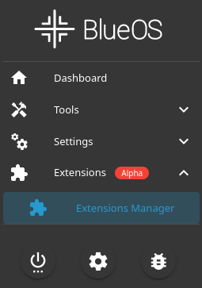
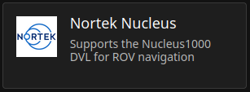
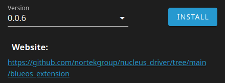
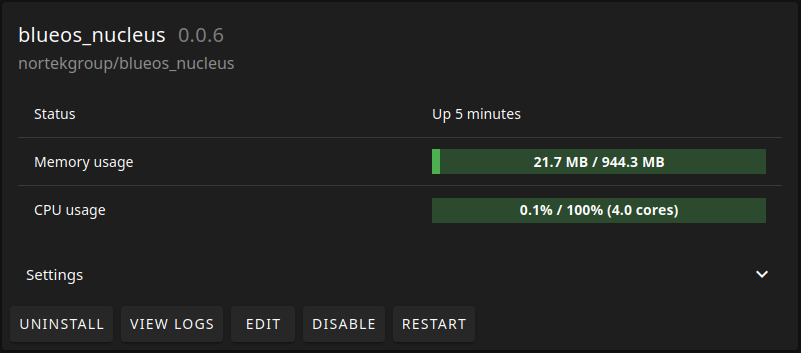
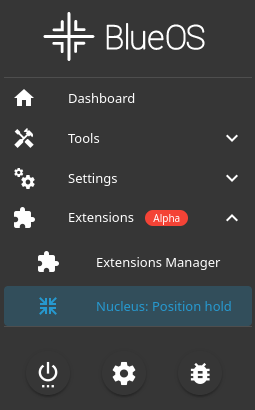

# BlueOS extension

This is a Nucleus extension for the BlueOS software running on BlueROV2. 

It works by wrapping the Nucleus Driver in a docker image, with a script that feeds velocity data from the Nucleus device into the ArduSub control system through mavlink commands.

This allows the user to utilize the "position hold" functionality in the ROV

## Nortek Nucleus integration

To mount the Nucleus unto the BlueROV2 and connect it to its network, refer Nortek's [Nucleus integration guide](https://support.nortekgroup.com/hc/en-us/articles/8246995934748-Nucleus-integration-with-BlueROV2).

## setup

### BlueOS

BlueOS needs to be of version 1.1.0-beta18 or newer in order to support the adding of third party extensions.

### ArduSub

ArduSub needs to be of version 4.1.0 or newer for it to support the VISUAL_POSITION_DELTA packets used to send velocity data to the ROV.

### Nucleus

This extension assumes that the Nucleus is connected to the network of the ROV through an ethernet connection. It is therefore necessary to set a static IP in the Nucleus.

The network prefix of the BlueROV2 is 192.168.2.0, with a netmask of 255.255.255.0. The Nucleus' static IP must therefore be set to a fitting value, i.e. 192.168.2.201. 

In the GUI that comes with the extension the user must specify this IP address to establish a connection with the Nucleus device. The user is therefore not limited to using this IP address, but is at the same time responsible of selecting an IP address that is not already in use on the network.

## Adding extension to BlueROV2

The extension can be added to the BlueROV2 either through the BlueOS software, or by creating the docker image on the onboard computer and running the docker container directly.

It is recommended to add the extension through BlueOS as it is both easier and the intended way for this extension to be added. The two different approaches are covered in the following subsections.

### BlueOS

#### Installation
The extension can be added through BlueOS' extensions menu.

Navigate to Extensions > Extensions Manager.



Locate Nortek Nucleus under the tab "STORE" and open it.



When the Nortek Nucleus extension is opened the user will be presented with this README, as well as information about the extensions creator, a link to this github repository, the settings in the docker image of the extension and the option of installing the extension.

To install the extension, select the newest available version in the drop down menu (the newest version should be the default) and push install. BlueOS will the pull the nucleus extension docker image and install it in its extensions.



#### Usage

After the installation has been completed. The extension can be located in Extensions > Extensions Manager, under the tab "INSTALLED".



Here the user have the option to edit sittings, uninstall, disable and restart the extension. It is also possible to view the output logs from the docker container that runs the extension which can serve as a good debugging tool.

The extension itself can be opened in the menu by navigating to Extensions > Nucleus: Position hold. 



Opening this will present the user with the GUI for the Nucleus extension which is covered in [Using the extension](#using-the-extension)

### Docker

To set this extension up manually, ssh into the Raspberry Pi on the BlueROV2 (or access via red-pill in [BlueOS terminal](https://docs.bluerobotics.com/ardusub-zola/software/onboard/BlueOS-1.0/advanced-usage/#terminal)).

**N.B.** The docker image available on dockerhub is set to use port 80 for its user interface which allows BlueOS to handle which port this user interface should be available at. For the manual approach it is therefore necessary to build the docker image with a different port if you wish to have access to the user interface.

**N.B.** In the current version of the extension it is necessary to have access to the GUI as it is required for establishing the connection to the Nucleus.

On the onboard computer, clone this repo in your preferred path with the following command:

```
git clone git@github.com:nortekgroup/nucleus_driver.git
```

Navigate to the blueos_extension folder (the folder containing the Dockerfile) and build the docker image with the following command:

```
docker build . -t nucleus_driver
```

The GUI of the extension is by default on port 5000. 

If another port is preferred for the GUI the image can be build with the preferred port as an argument with the following command

```
docker build . -t nucleus_driver --build-arg PORT=5000
```

with the value following "`PORT=`" being your preferred port.

The docker container can be executed with the following command

```
docker run --net=host --add-host=host.docker.internal:host-gateway -v /root/.config/blueos:/root/.config --name=nucleus_driver --restart=unless-stopped nucleus_driver
```

`--net=host` allows the container to share the network of the ROV which is necessary for it to communicate with the ROV and make the GUI available

`-v /root/.config/blueos:/root/.config` maps the volume "/root/.config/blueos" from the Raspberry Pi into "/root/.config" in the container. This allows the container the store configuration data in-between runs.

`--name=Nucleus-Driver` is the preferred name of the container.

`--restart=unless-stopped` allows the extension to automatically start when the ROV is powered up

With the docker container running, the GUI can be accessed in a browser by navigating to `blueos.local:<port>` (or `192.168.2.2:<port>`), where `<port>` is the specified port from the image creation. See [Using the extension](#using-the-extension) to learn about how to use the GUI.

## Using the extension

**N.B.** In order for the extension to work it is necessary to change certain controller parameters. Refer to "Controller parameters" section for more info

**N.B.** In order for the "position hold" algorithm to perform well it might be necessary to change the ROV's PID parameters. Refer to "PID parameters" section for more info

With the extension added, its user interface (GUI) can be found by navigating to Extensions -> Nucleus: Position hold in the BlueOS menu.

In the case of a manual installation through docker, the GUI can be found y navigating to `blueos.local:<port>` where `<port>` is he port specified when the docker image was created. 

The GUI presents the user with a home page and two pages for parametrization. These pages can be navigated in-between using the navigation banner at the top of the GUI

### Home

The home screen presents the user with a status field which displays the results of various checks performed during the startup of the ROV. It is necessary for all of these checks to pass in order for extension to work. Some easy troubleshooting is presented in the home screen in case any of these checks were to fail

The Nucleus hostname field is used to set the IP address used to connect to the Nucleus device. This IP address should be the same as the static IP configured on the Nucleus device.

It is also a field which allows the user to decide whether the driver is enabled. The driver must be enabled for it to feed velocity data to the ROV. If it is not enabled the driver is still running and extracting data from the Nucleus, but the velocity is not sent to the ROV.

The packet counter field displays how many velocity data packets has been handled by the extension. Sent packages refers to packages that has been sent to the ROV, Failed packets refers to packets that for some reason failed to be sent, and Skipped packets are packets that were in good condition and ready to be sent, but weren't due to the driver not being enabled.

### PID parameters

**N.B.** Adjusting any of these parameters **WILL** change the behavior of the ROV

**N.B.** Neither the extension nor the ROV will remember the original values of these parameters in case they are changed. It is therefore the users responsibility to remember the original values in case they wish to revert back to the original parameterization.

The PID parameters page gives the user opportunity to modify selected PID parameters in the controller. Good parameterization is necessary for a good performance of the ROV. The correct parameters varies from vehicle to vehicle as the physical attributes of the ROV has an impact on its behavior. However, recommended parameters for a standard BlueROV2 with only the Nucleus being the third party installation is presented on this page.

### Controller parameters

**N.B.** Adjusting any of these parameters may change the behavior of the ROV

**N.B.** Neither the extension nor the ROV will remember the original values of these parameters in case they are changed. It is therefore the users responsibility to remember the original values in case they wish to revert back to the original parameterization.

In order for the controller to accept and utilize the velocity packets sent from the Nucleus, certain parameters has to be changed. The parameters and their required values are presented on this page. 

After these parameters has been changed it is necessary to power cycle the vehicle for these parameters to take effect

