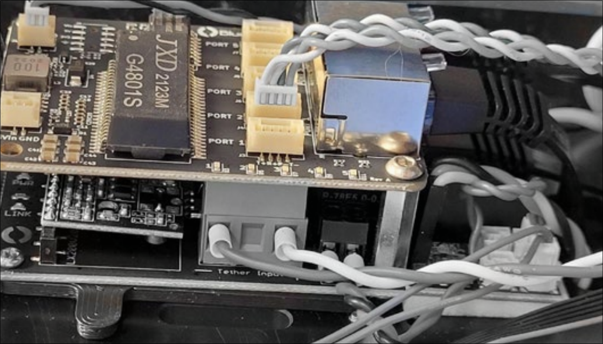
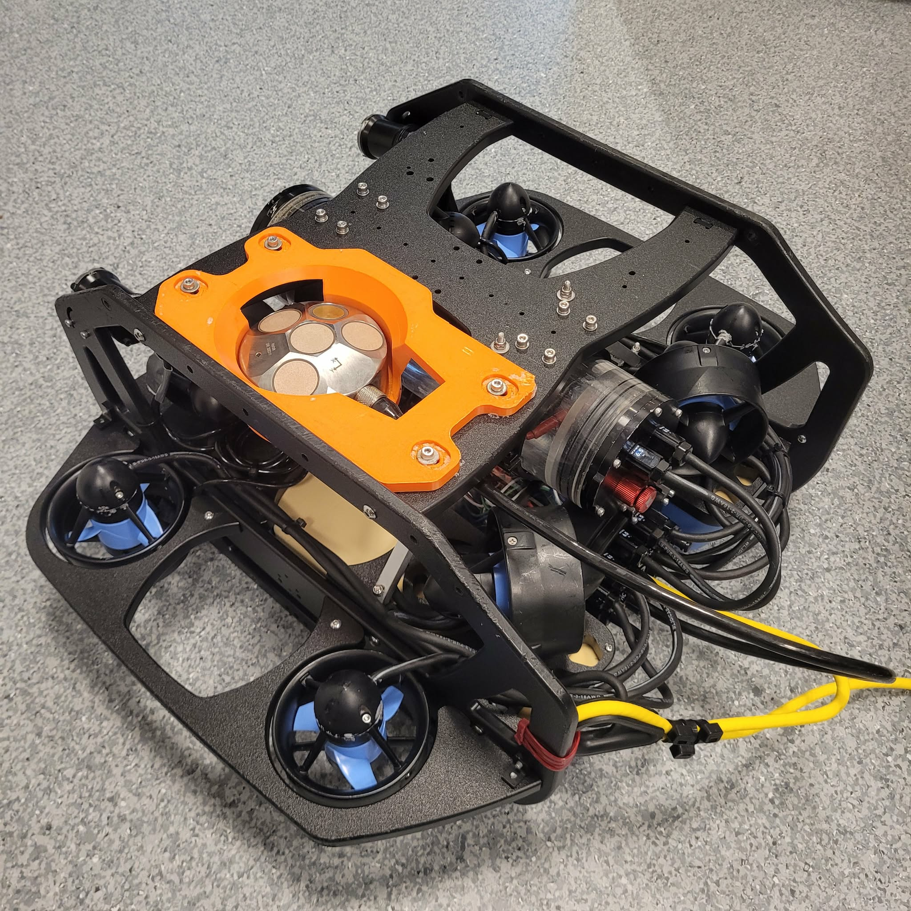
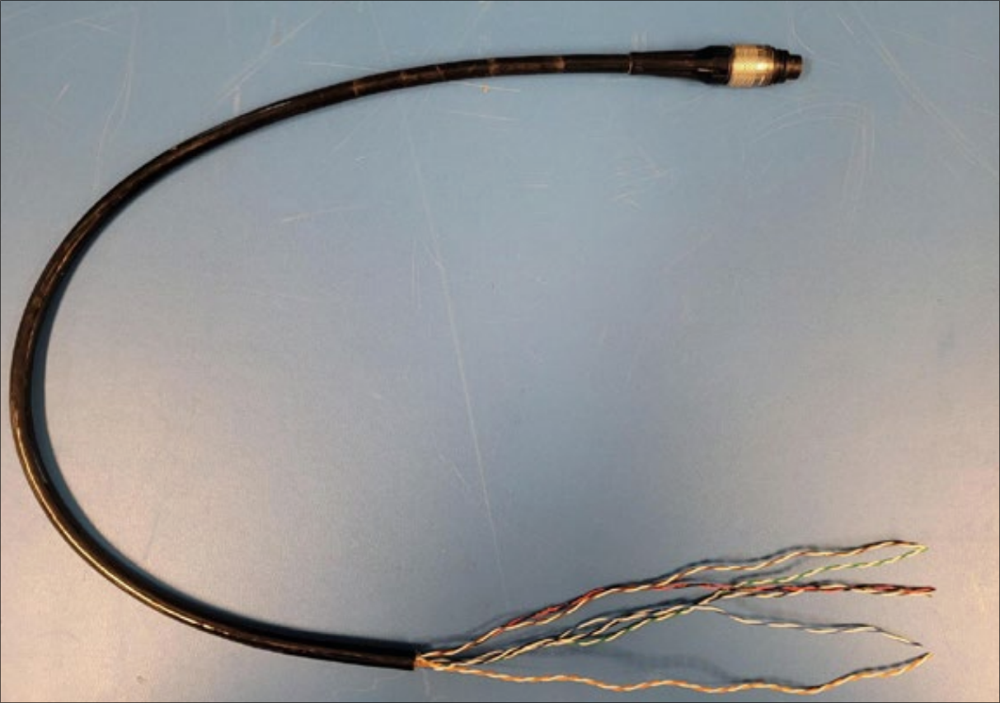
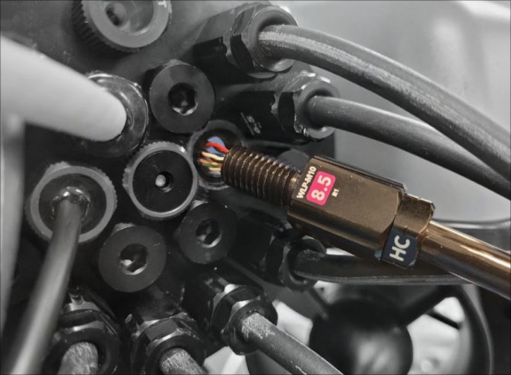
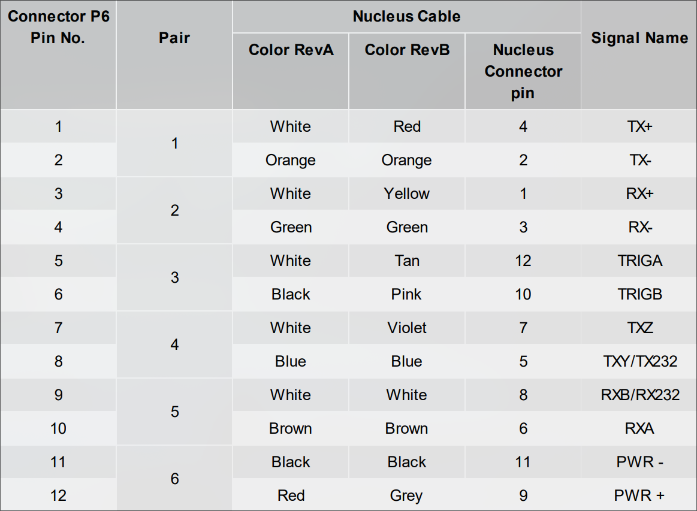
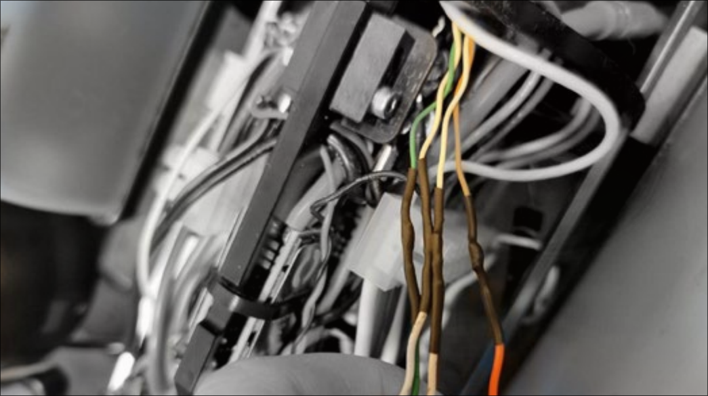
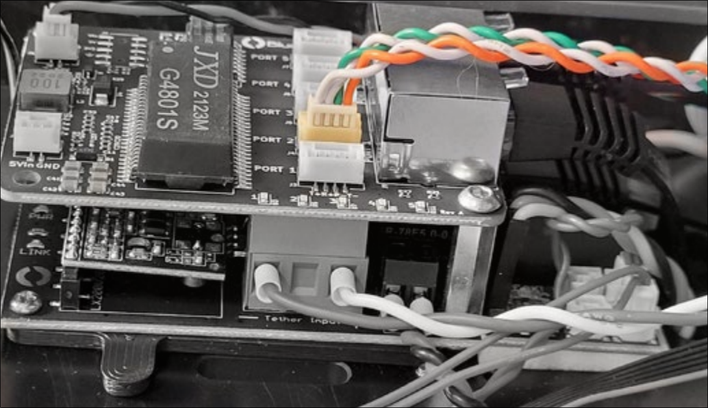
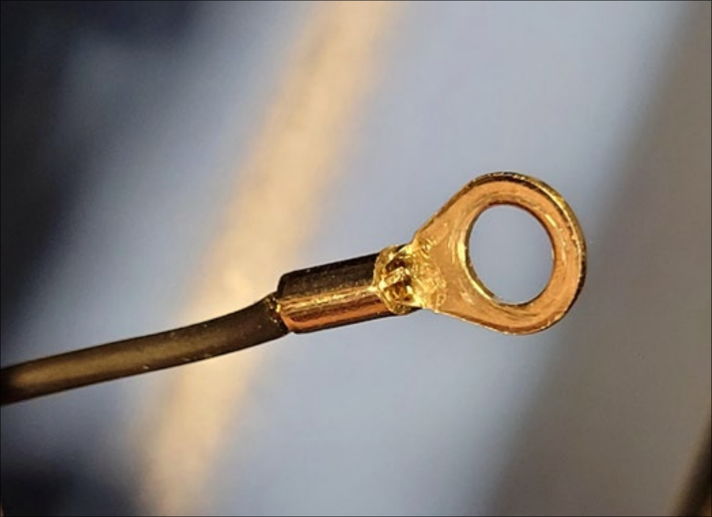

# Nucleus integration with BlueROV2

The purpose of this tutorial is to demonstrate how the Nortek Nucleus can be integrated with an ROV. To achieve this, we will be integrating it with a BlueROV2.
If there are any questions regarding this, please contact [Nortek support](https://support.nortekgroup.com/) and we will help you in any way we can.

Please keep in mind that this manual is specifically to integrate the Nucleus with BlueROV2, and steps/materials needed might differ from other integrations.

__Preparation:__

In this guid, the following was used:

* Nortek Nucleus
* BlueROV2
* Nortek Nucleus cable
* Cable cutters
* Screwdriver
* [Penetrator](https://bluerobotics.com/store/cables-connectors/penetrators/wlp-vp/) to fit Nucleus cable with diameter 7.75mm
* [Ethernet switch](https://bluerobotics.com/store/comm-control-power/tether-interface/ethswitch/)
* Heat shrink tubes
* Cable shoes
* Soldering kit

__References:__

* __Electronic housing__: The closure where all electronics are located on the BlueROV2.
* __Dry end cable vs wet end cable__: When referring to the wet end, we refer to the side of the cable that will be plugged into the Nucleus’ connector. The dry end is attached to the BlueROV2
electronic housing.

## Steps

__1. Create a static IP address to connect to the Nucleus. Here it is set to `192.168.2.201`. This can be
done by:__

1. Download and open the Nucleus Software
2. Connect your Nucleus either through Serial or Ethernet connection.
3. Open the Terminal, and type

```
SETETH,IPMETHOD=”STATIC”,IP=”192.168.2.201”
SAVE,COMM
```

Any IP address in `192.168.2.0/24` will work with the default BluROV2 configuration, just make sure to pick an available address.

__2. Connect the ethernet switch to the interface board.__

* Follow the [BlueROV2 guide](https://bluerobotics.com/learn/ethernet-switch-installation-guide-for-the-bluerov2/)



__3. Decide where to place the Nortek Nucleus on your ROV. Things to keep in mind:__

1. Use the two mounting holes in the Nucleus when attaching.
2. Avoid in front/behind thruster.
3. Avoid placement close to battery or thrusters to reduce noise (this is "impossible" on a BlueROV2)
4. It is recommended to avoid placements where the Nucleus is at risk of damage in case of
collision.



__4. Cut the cable on the dry end, to the appropriate length. Leave a bit of extra cable__

* The cable should be able to reach the housing + ethernet switch and power internally,
and Nucleus position externally

__5. Strip the cable where it enters the housing to expose the wires__



__6. Feed the cable into the penetrator.__

* Follow the [BlueROV2 guide](https://bluerobotics.com/learn/wetlink-penetrator-installation-guide/)

__7. Insert the penetrator into the BlueROV2.__



__8. Identify the Ethernet and Power wires. The other wires are for serial communication, and can
be ignored/packed away safely (perhaps a shrink tube on the edge).__

* The TX+, TX-, RX+, and RX- wires are used for ethernet communication, that is the white/
orange and white/green wire pairs on RevA, and the red/orange and yellow/green wire pairs on RevB. Refer to cable guide.



__9. Solder the Nucleus Ethernet cables onto the correct cables on the JST-GH connector and
cover the soldered wires with shrink tubes.__



__10. Insert your connector in either port 2, 3 or 4 of the switch PCB.__

* Make sure your cables matches the silk screen print



__11. Attach a cable shoe to the power cables and connect them directly to the BlueROV2 power
lines.__



__12. Reassemble the electronics enclosure.__

__13. Attach Nortek Nucelus to chosen position.__

__14. Perform a pressure test__

* This is especially important now that we have added another cable going into the wire system. A proper pressure test of the electronic housing will ensure that it is waterproof.
* The pressure testing is a part of the original assembly of the ROV which can be seen here.

__15. Power up the ROV and connect to the Nucleus through the ROV network using the static IP
address.__

For Nucleus driver integration with BlueOS extension, please refer to the [README](README.md) of this repo.